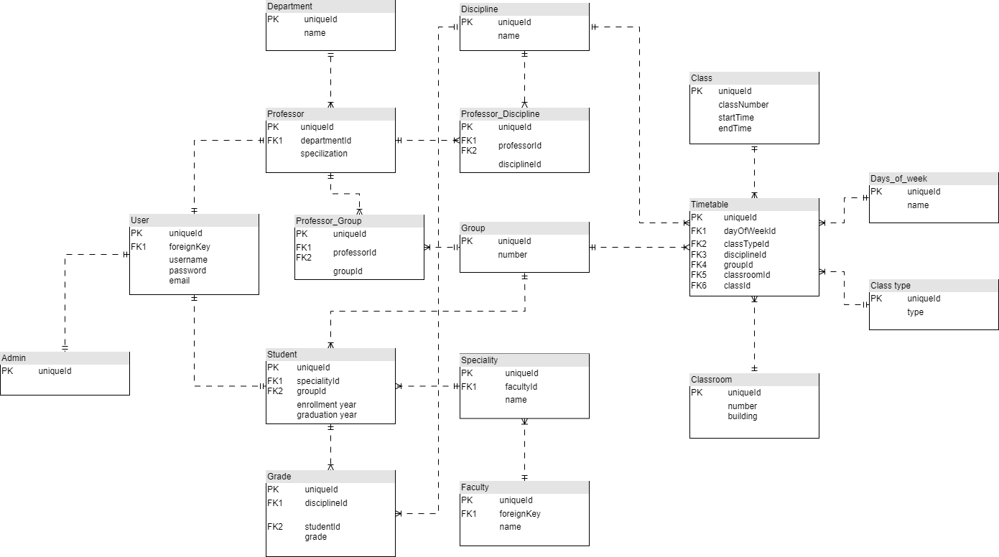

# Университет  
- [Функциональные требования](#функциональные-требования)
- [Перечень сущностей](#перечень-сущностей)
- [Даталогическая модель](#даталогическая-модель)

## Функциональные требования
### Система ролей представлена следующими типами пользователей:
- [Гость](#гость)
- [Студент](#студент)
- [Преподаватель](#преподаватель)
- [Администратор](#администратор)

### Гость
- Просмотр основной информации (...)
- Регистрация
- Авторизация  
### Студент
- Просмотр рейтинга
### Преподаватель
- Выставление оценок
### Администратор

## Перечень сущностей
1. **User** – таблица, описывающая пользователя
   
    1.1. **Поля**:
    - username
    - password
    - email
      
    1.2. **Связи**:
    - OneToOne с таблицей Student
    - OneToOne с таблицей Professor
    - OneToOne с таблицей Admin
  
2. **Admin**
3. **Professor**:

   3.1 **Поля**:
    - specialization
    - departmentId (FK)
   
   3.2 **Связи**:
   - ManyToMany с таблицей Discipline
   - ManyToMany с таблицей Group
   - ManyToOne с таблицей Department
   - OneToOne С таблицей User

4. **Student**:

   4.1 **Поля**:
   - enrollmentYear
   - graduationYear
   - specialityId (FK)
   - groupId (FK)

   4.2 **Связи**:
   - ManyToOne с таблицей Group
   - ManyToOne с таблицей Speciality
   - OneToMany с таблицей Grade
   - OneToOne с таблицей User
  
5. **Faculty**:
   
    4.1 **Поля**:
   - name

   4.2 **Связи**:
   - OneToMany с таблицей Speciality
   
6. **Speciality**:
   
    4.1 **Поля**:
   - name
   - facultyId (FK)

   4.2 **Связи**:
   - ManyToOne с таблицей Faculty
   - OneToMany с таблицей Student
     
7. **Department**:

    4.1 **Поля**:
   - name

   4.2 **Связи**:
   - OneToMany с таблицей Professor
   
8. **Discipline**:

    4.1 **Поля**:
   - name

   4.2 **Связи**:
   - ManyToOne с таблицей Group
   - ManyToOne с таблицей Speciality
   - OneToMany с таблицей Grade
   - OneToOne с таблицей User
   
10. **Group**:
11. **Grade**:
12. **Timetable**:
13. **Class**:
14. **Classroom**:
15. **ClassType**:
16. **DaysOfWeek**:

## Даталогическая модель

